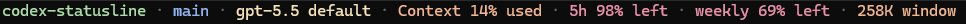

# codex-statusline

WSL2 で使う Codex TUI 向けの、コンパクトなステータスライン設定例です。

モデル、コンテキスト使用量、5時間制限、週間制限、コンテキストウィンドウをフッターにまとめて表示します。

外部スクリプトやレンダラーは不要で、Codex CLI に組み込みのステータスライン機能だけで完結します。



スクリーンショットはターミナル下部だけを切り抜いたものです。

## 前提

- TUI のステータスライン設定に対応した Codex CLI
- WSL2
- WSL2 の Linux 環境内にある `~/.codex/config.toml`

WSL2 では、`~/.codex/config.toml` は Windows 側ではなく、利用している Linux ディストリビューション内のパスを指します。

例:

```text
/home/<linux-user>/.codex/config.toml
```

Codex CLI が Windows 側の設定を読んでいる場合を除き、`C:\Users\<windows-user>\.codex\config.toml` のような Windows 側のパスではなく、WSL2 側の設定ファイルを編集してください。

## 導入方法

まず、既存の Codex 設定をバックアップします。

```bash
cp ~/.codex/config.toml ~/.codex/config.toml.bak
```

設定ファイルを開きます。

```bash
nano ~/.codex/config.toml
```

次の設定を追加、または既存の `[tui]` セクションを更新してください。

```toml
[tui]
status_line = [
  "model-with-reasoning",
  "context-used",
  "five-hour-limit",
  "weekly-limit",
  "context-window-size",
]
status_line_use_colors = true
```

保存後、Codex を再起動してください。

## `/statusline` で設定する方法

Codex TUI 内の `/statusline` から同じ内容を設定することもできます。

1. Codex を起動します。
2. `/statusline` を実行します。
3. 次の項目を選び、同じ順番に並べます。
   - `model-with-reasoning`
   - `context-used`
   - `five-hour-limit`
   - `weekly-limit`
   - `context-window-size`
4. 選択内容を保存します。

保存すると、Codex が `~/.codex/config.toml` に設定を反映します。

## 補足

Codex のステータスラインは、Codex に組み込まれている item ID を並べて設定します。このリポジトリは外部レンダラーやシェルスクリプトをインストールするものではありません。

利用中の Codex が上記の item ID を認識しない場合は、Codex を更新するか、`/statusline` のメニューから近い項目を選んでください。

## 関連リポジトリ

Claude Code 用のステータスラインは別リポジトリ [claude-code-statusline](https://github.com/YATA-NODE/claude-code-statusline) にあります。あちらは Python スクリプトで描画し、補助機能として Codex CLI のレート残量を並置表示することもできます。

両者は対象ツールと仕組みが異なります。

|  | claude-code-statusline | codex-statusline（本リポジトリ） |
|---|---|---|
| 対象 | Claude Code | Codex CLI (TUI) |
| 仕組み | 外部 Python スクリプトで描画 | Codex 組み込みの設定のみ |
| 追加インストール | `statusline.py` が必要 | 不要（`config.toml` の設定だけ） |

## ライセンス

MIT
